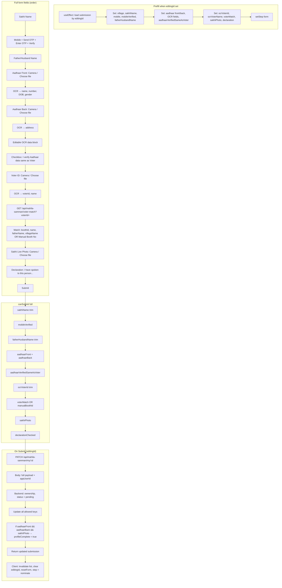
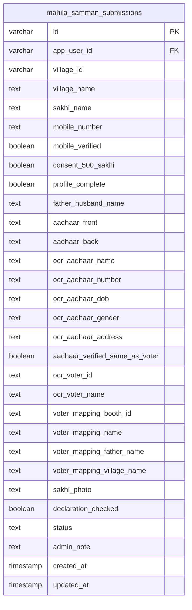
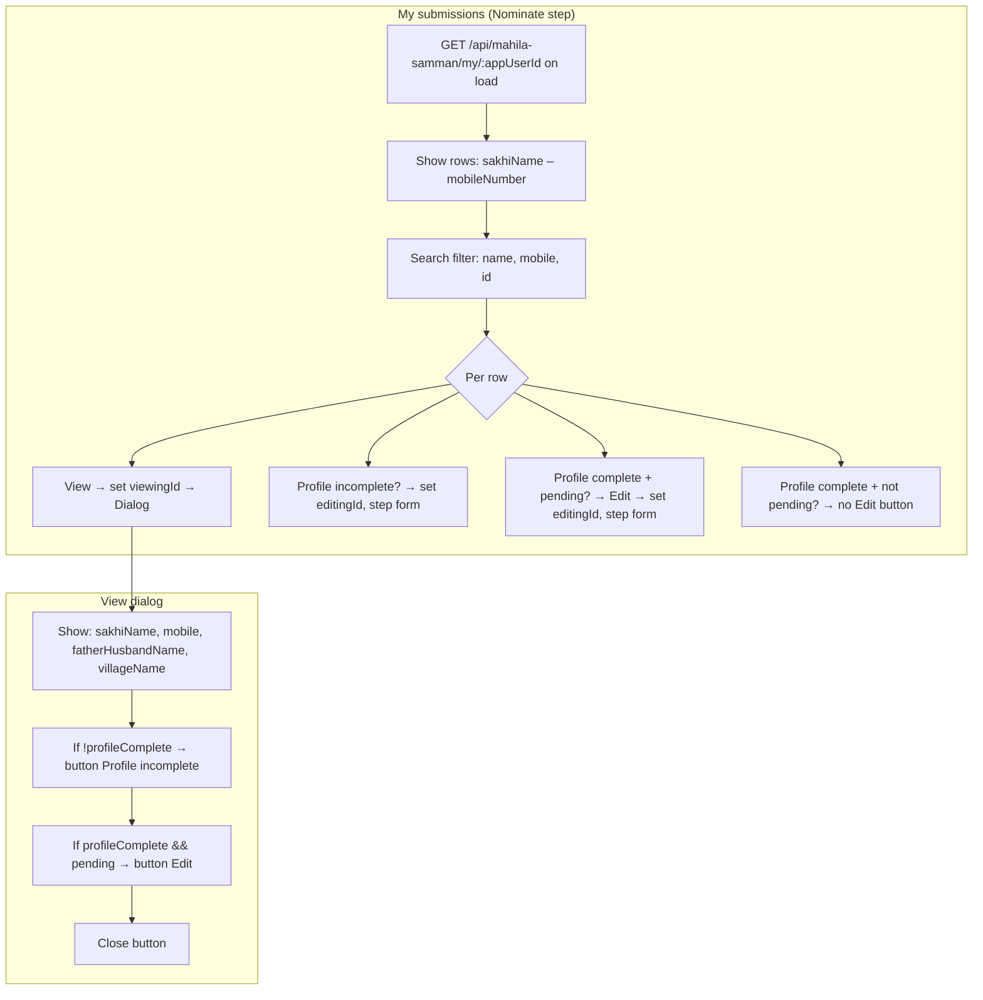
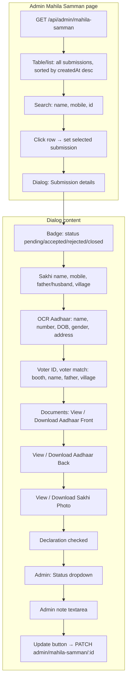
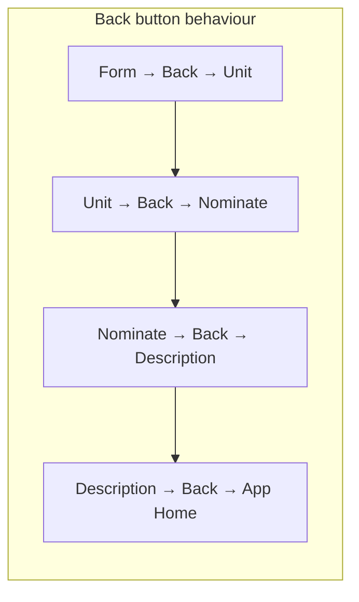

# Mahila Samman Rashi – Complete Flow (Start to End)

Below is the full flowchart so koi bhi detail miss na ho.

---

## 1. High-level flow (user + admin + backend)

```mermaid
flowchart TB
    subgraph ENTRY["Entry"]
        A1[App Home / Task List]
        A2[User clicks Mahila Samman Rashi card]
        A3[/task/mahila-samman-rashi → TaskMahilaSamman]
    end
    A1 --> A2 --> A3

    subgraph USER_STEPS["User steps (client)"]
        S1[Step: Description]
        S2[Step: Nominate]
        S3[Step: Unit]
        S4[Step: Form]
    end
    A3 --> S1 --> S2
    S2 --> S3 --> S4

    subgraph BACKEND["Backend APIs"]
        API_OTP[POST send-otp / verify-otp]
        API_VOTER[GET voter-match]
        API_SUBMIT[POST submit]
        API_MY[GET my/:appUserId]
        API_PATCH[PATCH my/:id]
        API_ADMIN_LIST[GET admin/mahila-samman]
        API_ADMIN_ONE[GET admin/mahila-samman/:id]
        API_ADMIN_PATCH[PATCH admin/mahila-samman/:id]
    end

    subgraph ADMIN["Admin"]
        AD1[Admin panel → Mahila Samman Rashi]
        AD2[List all submissions, search]
        AD3[View details, documents View/Download]
        AD4[Set status + admin note → PATCH]
    end
    AD1 --> AD2 --> AD3 --> AD4
    AD4 --> API_ADMIN_PATCH
```

---

## 2. User flow – step by step (detail)

```mermaid
flowchart TB
    subgraph STEP1["Step 1: Description"]
        D1[Screen: Scheme description]
        D2[₹1000/month women, ₹1500/month SC/ST]
        D3[Button: Next]
        D4[Back → App Home]
    end
    D1 --> D2 --> D3
    D1 --> D4

    subgraph STEP2["Step 2: Nominate"]
        N1[Screen: Nominate a Sakhi]
        N2[Card: What is Booth Sakhi + duties + video note]
        N3[My submissions list]
        N4[Search by name, mobile, ID]
        N5[Per row: View | Profile incomplete OR Edit]
        N6[Button: Add new nomination]
        N7[View → Dialog: details, Profile incomplete / Edit / Close]
    end
    N1 --> N2 --> N3 --> N4 --> N5 --> N6
    N5 --> N7

    subgraph STEP2_DECISION["From Nominate"]
        ND1{User action?}
        ND2[Add new nomination → Step: Unit]
        ND3[Profile incomplete → set editingId → Step: Form full]
        ND4[Edit pending → set editingId → Step: Form full]
        ND5[View only → Dialog → Close or Profile incomplete/Edit]
    end
    N6 --> ND1
    N5 --> ND1
    ND1 --> ND2
    ND1 --> ND3
    ND1 --> ND4
    ND1 --> ND5

    subgraph STEP3["Step 3: Unit"]
        U1[UnitSelector: Select village/ward]
        U2[On select: set villageId, villageName → Step: Form]
        U3[Back → Nominate]
    end
    ND2 --> U1 --> U2
    U1 --> U3

    subgraph STEP4["Step 4: Form"]
        F0{editingId set?}
        F_SIMPLE["Simple form (new nomination)"]
        F_FULL["Full form (complete profile / edit)"]
    end
    U2 --> F0
    ND3 --> F0
    ND4 --> F0
    F0 -->|No| F_SIMPLE
    F0 -->|Yes| F_FULL
```

---

## 3. Simple form (first-time registration) – detail

```mermaid
flowchart LR
    subgraph SIMPLE["Simple form fields"]
        S1[Sakhi Name]
        S2[Mobile Number]
        S3[Send OTP → POST /api/mahila-samman/send-otp]
        S4[Enter OTP]
        S5[Verify → POST /api/mahila-samman/verify-otp]
        S6[mobileVerified = true]
        S7[Consent: Serve as Sakhi and ensure at least 50 women receive Mahila Samman Rashi]
        S8[Submit button]
    end
    S1 --> S2 --> S3 --> S4 --> S5 --> S6 --> S7 --> S8

    subgraph SIMPLE_API["On Submit"]
        SA1[POST /api/mahila-samman/submit]
        SA2[Body: appUserId, villageId, villageName, sakhiName, mobileNumber, mobileVerified, consentServeSakhi50]
        SA3[Backend: isMinimal = consentServeSakhi50 && !aadhaarFront]
        SA4[Create row: profile_complete = false, rest null/false]
        SA5[Return created submission]
        SA6[Client: invalidate my list, resetForm, step = nominate, toast]
        SA7[Success modal: Add another / Close]
    end
    S8 --> SA1 --> SA2 --> SA3 --> SA4 --> SA5 --> SA6 --> SA7
```



---

## 4. Full form (profile complete / edit) – detail



---

## 5. Backend APIs – detail

```mermaid
flowchart TB
    subgraph OTP["OTP"]
        O1[POST /api/mahila-samman/send-otp]
        O2[Body: mobile]
        O3[Validate: 10-digit Indian mobile]
        O4[normalizeMobile, storeOTP mahila_samman_&lt;mobile&gt;]
        O5[If SMS configured: sendOtpSms]
        O6[Return success, maskedMobile]
        O7[POST /api/mahila-samman/verify-otp]
        O8[Body: mobile, otp]
        O9[verifyOTP → 401 if invalid]
        O10[Return verified true]
    end
    O1 --> O2 --> O3 --> O4 --> O5 --> O6
    O7 --> O8 --> O9 --> O10

    subgraph VOTER["Voter match"]
        V1[GET /api/mahila-samman/voter-match?voterId=]
        V2[storage.getVoterMappingByVoterId]
        V3[Return match: boothId, name, fatherName, villageName or null]
    end
    V1 --> V2 --> V3

    subgraph SUBMIT["Submit"]
        SUB1[POST /api/mahila-samman/submit]
        SUB2[Read body]
        SUB3{isMinimal? consentServeSakhi50 && !aadhaarFront}
        SUB4[Minimal: require appUserId, sakhiName, mobileNumber, mobileVerified]
        SUB5[Insert: profile_complete false, consent_500_sakhi true, rest null]
        SUB6[Full: require all fields incl fatherHusbandName, aadhaar, voter, photo, declaration]
        SUB7[Insert: profile_complete true, all OCR/voter/sakhi data]
        SUB8[Return created row]
    end
    SUB1 --> SUB2 --> SUB3
    SUB3 -->|Yes| SUB4 --> SUB5 --> SUB8
    SUB3 -->|No| SUB6 --> SUB7 --> SUB8

    subgraph MY["My submissions"]
        M1[GET /api/mahila-samman/my/:appUserId]
        M2[storage.getMahilaSammanSubmissionsByUser]
        M3[Return list ordered by createdAt desc]
    end
    M1 --> M2 --> M3

    subgraph PATCH_USER["User PATCH"]
        P1[PATCH /api/mahila-samman/my/:id]
        P2[Get existing submission]
        P3[404 if not found]
        P4[403 if existing.appUserId !== body.appUserId]
        P5[400 if existing.status !== pending]
        P6[Build update from body keys: village, sakhiName, mobile, fatherHusbandName, aadhaar*, ocr*, voter*, sakhiPhoto, declarationChecked]
        P7[If body has aadhaarFront and aadhaarBack and sakhiPhoto → update.profileComplete = true]
        P8[storage.updateMahilaSammanSubmission]
        P9[Return updated row]
    end
    P1 --> P2 --> P3 --> P4 --> P5 --> P6 --> P7 --> P8 --> P9

    subgraph ADMIN_API["Admin APIs"]
        AD1[GET /api/admin/mahila-samman → all submissions]
        AD2[GET /api/admin/mahila-samman/:id → one submission]
        AD3[PATCH /api/admin/mahila-samman/:id]
        AD4[Body: status, adminNote]
        AD5[Update status, adminNote only]
    end
    AD1 --> AD2
    AD3 --> AD4 --> AD5
```



---

## 6. Database schema (mahila_samman_submissions)



---

## 7. My Submissions list – behaviour



---

## 8. Admin panel – detail



---

## 9. Navigation (Back)



---

## 10. Status & profile complete summary

| Scenario | profile_complete | status | User sees |
|----------|------------------|--------|-----------|
| Just submitted (minimal form) | false | pending | "Profile incomplete" button |
| User clicked Profile incomplete, filled full form, submitted | true | pending | "Edit" button |
| Admin accepted/rejected/closed | true/false | accepted/rejected/closed | No Edit (only View) |

- **Profile incomplete**: Only when `profile_complete === false`. Click → full form with that submission’s data; submit → PATCH, backend sets `profile_complete = true` if aadhaar front/back + sakhi photo sent.
- **Edit**: Only when `profile_complete === true` and `status === 'pending'`. Click → full form; submit → PATCH (same as above).

---

Yeh document start se end tak Mahila Samman ka pura flow cover karta hai: entry, description → nominate → unit → form (simple + full), OTP, voter match, submit/PATCH, my list, profile incomplete vs edit, admin list/view/update, aur schema. Koi chiz omit nahi ki gayi.
